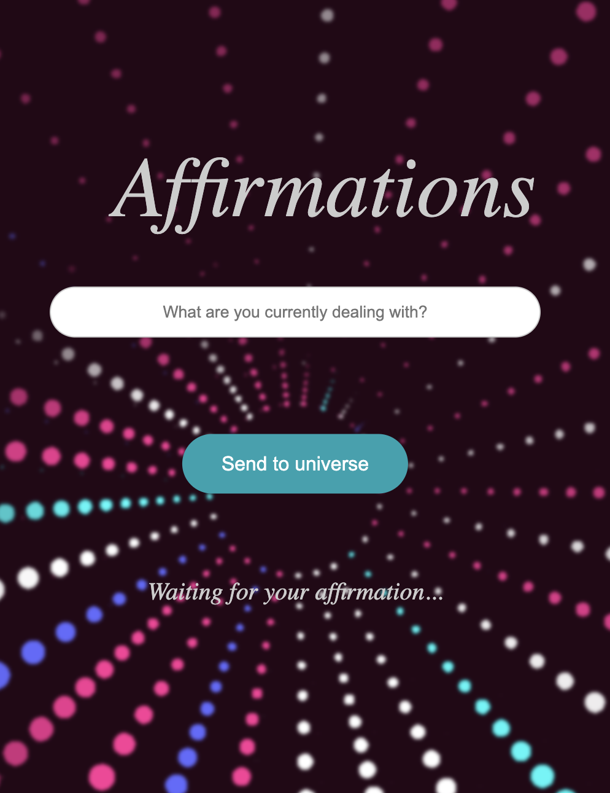
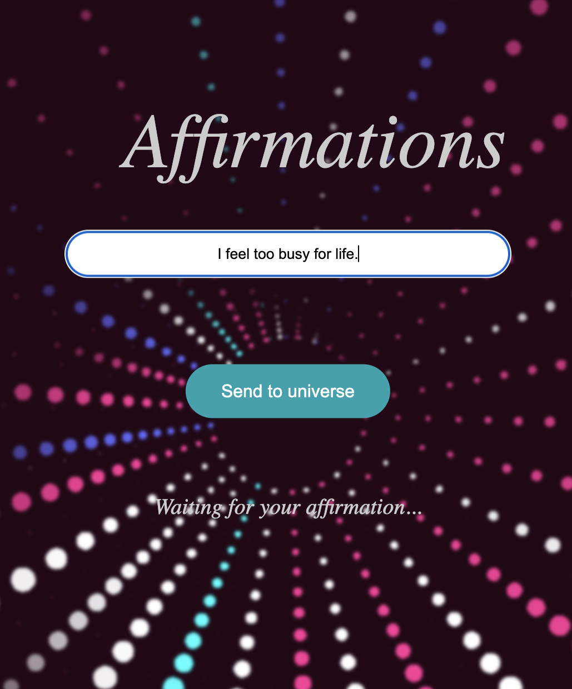
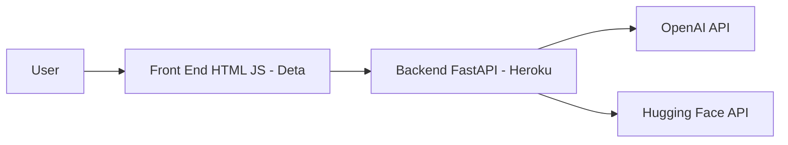

# Affirmations

Using AI's superpowers to help us in our darkest times. @ilaydabdogan and @bcigdemoglu came up with the idea of using OpenAI's GPT and Mistral model on Hugging Face to generate affirmations for people who are feeling down or need a little boost. The idea is to provide a platform where people can come and get a personalized affirmation to improve their quality of life. The affirmation is generated based on the user's input and the model's understanding of the world.

## How to Use

Follow these simple steps to get your affirmation:

1. **Visit the Website:**
   Navigate to the website to start the process.
   

2. **Enter Your Problem:**
   In the provided input field, type in what you're currently dealing with and then click "Get Affirmation."
   

3. **Receive Your Affirmation:**
   The universe will provide you with a personalized affirmation. Embrace it and feel the positivity flow through you.
   

## https://affirmations-1-m6137384.deta.app

## High level architecture



## Backend Build Setup

```bash
# Install pip if "pip" not installed
pip -V || brew install python@3.9

# Setup python virtual env
python3.9 -m venv env
source ./env/bin/activate
python -m pip install --upgrade pip

# Install reqs
pip install -r requirements.txt

# Add you OPENAI_API_KEY and MONGODB_URL to a SECRETS.sh file at root
source SECRETS.sh
```

### Update pip requirements

```bash
pip freeze > requirements.txt
```

## Run backend

```bash
python -m uvicorn backend.app:app --host 127.0.0.1 --port 5000 --reload
```

Access website from http://127.0.0.1:5000
Swagger Docs from http://127.0.0.1:5000/docs
Redoc Docs from http://127.0.0.1:5000/redoc

https://journey-within-outside.herokuapp.com/random-affirmation

## Testing

### Test Backend

```bash
python -m pytest tests/tests.py
```

## Backend Development Guide

Following steps on <https://tutlinks.com/create-and-deploy-fastapi-app-to-heroku/>

```bash
# Setup ptyhon and virtual env
python3.9 -m venv env
source ./env/bin/activate
python -m pip install --upgrade pip

# Install fast api with all reqs
pip install "fastapi[all]"

# To serve on heroku
pip install gunicorn requests

# Freeze all reqs
pip freeze > requirements.txt
```

Test frontend

```
cd frontend && python -m http.server; cd ..
```

## Pushing code to public

```
# Install space
curl -fsSL https://get.deta.dev/space-cli.sh | sh
space login

# Push to public
space push
```

## Spinning up local testing

```
source ./env/bin/activate && source SECRETS.sh
space dev
```
